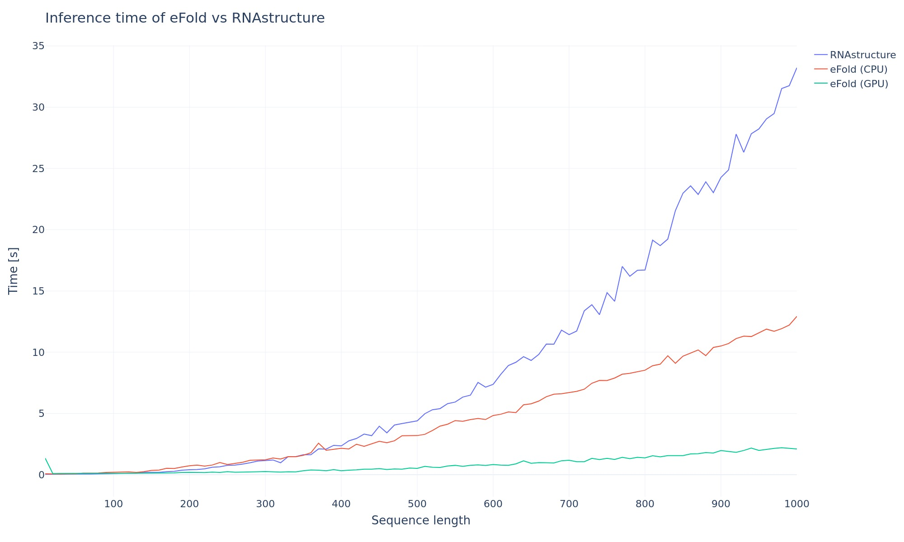

# eFold

This repo contains the pytorch code for our paper “*Diverse Database and Machine Learning Model to narrow the generalization gap in RNA structure prediction”* 

[[BioRXiv](https://www.biorxiv.org/content/10.1101/2024.01.24.577093v1.full)] [[Data](https://huggingface.co/rouskinlab)]

## Install

```bash
pip install efold
```


## Inference mode

### Using the command line

From a sequence:

```bash
efold AAACAUGAGGAUUACCCAUGU -o seq.txt
cat seq.txt

AAACAUGAGGAUUACCCAUGU
..(((((.((....)))))))
```

or a fasta file:

```bash
efold --fasta example.fasta
```

Using different formats:
```bash
efold AAACAUGAGGAUUACCCAUGU -bp # base pairs
efold AAACAUGAGGAUUACCCAUGU -db # dotbracket (default)
```

Output can be .json, .csv or .txt
```bash
efold AAACAUGAGGAUUACCCAUGU -o output.csv
```

Run help:
```bash
efold -h
```

### Using python

```python
>>> from efold.api.run import run
>>> run('AAACAUGAGGAUUACCCAUGU', fmt='dotbracket')
{'AAACAUGAGGAUUACCCAUGU': '..(((((.((....)))))))'}
```

## Inference speed
Tested on a AMD EPYC 7272 12 core processor, with 32GB RAM and a RTX3090 GPU



## File structure

```bash
efold/
    api/    # for inference calls
    core/   # backend 
    models/ # where we define eFold and other models
    resources/
        efold_weights.pt # our best model weights
conf/       # Hydra configuration files
    model/  # model configurations
    data/   # dataset configurations
    trainer/  # trainer configurations
    logging/  # logging configurations
train.py    # unified training entry point
LICENSE
pyproject.toml
```

## Data

### List of the datasets we used

A breakdown of the data we used is summarized [here](https://github.com/rouskinlab/efold_data). All the data is stored on the [HuggingFace](https://huggingface.co/rouskinlab). 

### Get the data

You can download our datasets using [rouskinHF](https://github.com/rouskinlab/rouskinhf):

```bash
pip install rouskinhf
```

And in your code, write:

```python
>>> import rouskinhf
>>> data = rouskinhf.get_dataset('ribo500-blast') # look at the dataset names on huggingface
```

## Training

We use [Hydra](https://hydra.cc/) for configuration management, enabling flexible and composable configurations.

### Quick Start

Train eFold model with default settings:
```bash
python train.py
```

### Model Selection

Train different models by overriding the model config:

```bash
# eFold model (default)
python train.py model=efold

# CNN model
python train.py model=cnn

# Transformer model
python train.py model=transformer
```

### Dataset Selection

Choose different datasets:

```bash
# Structure prediction datasets
python train.py data=structure

# Ribonanza dataset (DMS/SHAPE)
python train.py data=ribonanza

# Custom dataset
python train.py data=efold_train
```

### Training Configuration

Customize training parameters:

```bash
# Single GPU training
python train.py trainer=default

# Multi-GPU DDP training
python train.py trainer=ddp

# Adjust hyperparameters
python train.py model.lr=1e-4 model.dropout=0.1 trainer.max_epochs=50

# Change batch size and accumulation
python train.py data.batch_size=4 trainer.accumulate_grad_batches=16
```

### Logging with Weights & Biases

Enable W&B logging:

```bash
python train.py logging=wandb_enabled logging.project=my-project logging.name=my-run
```

### Multi-run Sweeps

Run hyperparameter sweeps with Hydra multirun:

```bash
# Grid search over learning rates
python train.py --multirun model.lr=1e-3,5e-4,1e-4

# Sweep over multiple parameters
python train.py --multirun model.lr=1e-3,1e-4 model.dropout=0.0,0.1,0.2
```

### Configuration Files

All configurations are stored in `conf/` directory:

- `conf/config.yaml` - Main config with defaults
- `conf/model/` - Model architectures (efold, cnn, transformer)
- `conf/data/` - Dataset configurations
- `conf/trainer/` - PyTorch Lightning trainer settings
- `conf/logging/` - Logging configurations

### Custom Configurations

Create your own config file in `conf/model/my_model.yaml`:

```yaml
_target_: efold.models.factory.create_model

model: efold
ntoken: 5
d_model: 128
c_z: 64
d_cnn: 128
num_blocks: 6
no_recycles: 2
dropout: 0.1
lr: 0.0005
weight_decay: 0.0001
gamma: 0.995
wandb: ${logging.use_wandb}
```

Then use it:
```bash
python train.py model=my_model
```

### Advanced Usage

Override any config parameter from command line:

```bash
# Override nested parameters
python train.py model.d_model=256 model.num_blocks=8

# Change multiple datasets
python train.py data.name=[bpRNA,ribo500-blast] data.batch_size=2

# Adjust validation sets
python train.py data.external_valid=[PDB,archiveII_blast]

# Set random seed for reproducibility
python train.py seed=12345
```

### Testing

A [notebook](tests/test_eFold.ipynb) is provided to run eFold inference on the four test sets, compute the F1 score and check the validity of the structures.


## Citation

**Plain text:**

Albéric A. de Lajarte, Yves J. Martin des Taillades, Colin Kalicki, Federico Fuchs Wightman, Justin Aruda, Dragui Salazar, Matthew F. Allan, Casper L’Esperance-Kerckhoff, Alex Kashi, Fabrice Jossinet, Silvi Rouskin. “Diverse Database and Machine Learning Model to narrow the generalization gap in RNA structure prediction”. bioRxiv 2024.01.24.577093; doi: https://doi.org/10.1101/2024.01.24.577093. 2024

**BibTex:**

```
@article {Lajarte_Martin_2024,
	title = {Diverse Database and Machine Learning Model to narrow the generalization gap in RNA structure prediction},
	author = {Alb{\'e}ric A. de Lajarte and Yves J. Martin des Taillades and Colin Kalicki and Federico Fuchs Wightman and Justin Aruda and Dragui Salazar and Matthew F. Allan and Casper L{\textquoteright}Esperance-Kerckhoff and Alex Kashi and Fabrice Jossinet and Silvi Rouskin},
	year = {2024},
	doi = {10.1101/2024.01.24.577093},
	URL = {https://www.biorxiv.org/content/early/2024/01/25/2024.01.24.577093},
	journal = {bioRxiv}
}

```
